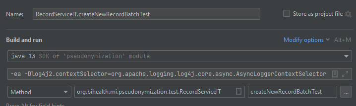
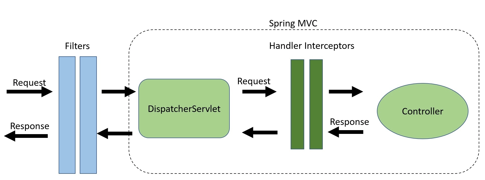

//TODO update @Armin

# Audit trail
## Installation
### Packages
Packages are automatically installed by `maven` when launching for the first time.

### Keycloak
Add group-names of the requested user to the id token by creating a mapper in the respective client.
This step is optional, but if you don't do this, all annotated requests will be logged as an audit trail.
You can follow this explanation to add group-names to the id token: https://stackoverflow.com/a/56372674

### VM options
To enable asynchronous logging (optional, enabled by default in production environment), please add the following command while starting the Java VM with `spring boot`:
```
-Dlog4j2.contextSelector=org.apache.logging.log4j.core.async.AsyncLoggerContextSelector
```

## How it works
We defined a Java annotation `@Auditable` that can be placed above any controller method to make requests by that method auditable.

Example:
```java
@Auditable(event = AuditEvent.READ, message = "Requested a record", auditHumanRequests = true, auditTechnicalRequests = true)
public ResponseEntity<T> doSomething(@PathVariable String path) {
   ...
}
```

- `event`: The enums of `AuditEvent` can be utilized to define the specific event. 
- `message`: Provided messages should be kept simple and meaningful. 
- `auditHumanRequests`: Marks whether a request should be logged as requested by a human user.
- `auditHumanRequests`: Marks whether a request should be logged as requested by a technical user.

### For development
How to apply the command to a test (Example shown: IntelliJ)


## Technology
### Stack
Instead of the logging functionality provided by `spring boot`, we use native `log4j` and installed `disruptor` for fully asynchronous, non-blocking logging.
A custom logging solution was implemented instead of <https://logging.apache.org/log4j-audit/latest/index.html>.

- [log4j 2.X](https://logging.apache.org/log4j/2.x/index.html)
- [disruptor 3.X](https://logging.apache.org/log4j/2.x/manual/async.html) 

### Asynchronous logging
All implemented loggers are asynchronous by default (see `log4j.xml` in the `resource` folder for the configuration). We have created a custom logging level `AUDIT` (uses a custom console appender provided with a JSON template). The other logging levels are handled as usual.

### How it works
Different Spring Boot Stages


To provide out-of-the-box functionality, we hook into different stages of 'Spring Boot' to capture required information directly.
First, we use `ContentCachingRequestWrapper` and `ContentCachingResponseWrapper` before the request is handled. This is needed to access the request and response body.
Second, the captured and processed information is logged to `AUDIT`.
Finally, we make use of the [Thread Context](https://logging.apache.org/log4j/2.x/manual/thread-context.html) to save sensitive context information across different stages for logging.

1. Incoming request in Filter: Immediately create `ContentCachingRequestWrapper` and `ContentCachingResponseWrapper` objects.
2. `preHandle`: Before processing the request, always clear `Thread Context` in the interceptor.
3. `afterCompletion`: Capture the data and write it back into the request if the `@Auditable` annotation is used.
4. Outgoing request / response in filter: We check again whether the `@Auditable` flag has been set. If yes, we capture another chunk of data and fire the logging process.

## Links
- [https://www.callicoder.com/spring-boot-log4j-2-example/](https://www.callicoder.com/spring-boot-log4j-2-example/)
- [https://www.stackhawk.com/blog/creating-an-audit-trail-for-spring-controllers/](https://www.stackhawk.com/blog/creating-an-audit-trail-for-spring-controllers/)
- [https://stackoverflow.com/a/42023374](https://stackoverflow.com/a/42023374)
- [https://logging.apache.org/log4j/2.x/index.html](https://logging.apache.org/log4j/2.x/index.html)
- [https://logging.apache.org/log4j/2.x/manual/thread-context.html](https://logging.apache.org/log4j/2.x/manual/thread-context.html)
- [https://logging.apache.org/log4j/2.x/manual/async.html](https://logging.apache.org/log4j/2.x/manual/async.html)
- [https://en.wikipedia.org/wiki/Audit_trail](https://en.wikipedia.org/wiki/Audit_trail)
- [https://logging.apache.org/log4j-audit/latest/index.html](https://logging.apache.org/log4j-audit/latest/index.html)
- [https://stackoverflow.com/a/56372674](https://stackoverflow.com/a/56372674)
