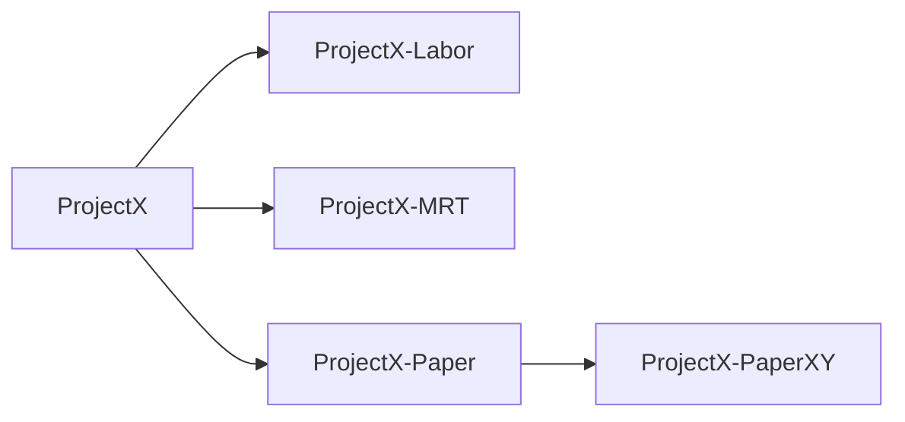

# Use Cases

--8<-- "docs/assets/snippets/remember-access-token.snippet"

These are some use cases or common scenarios you might encounter in your daily work.
We try to collect and describe them for everyone in the following sections.

## Create a mesh of Domains

| Item           | Description                                                                                                                  |
| -------------- | ---------------------------------------------------------------------------------------------------------------------------- |
| Used Interface | - /domain <br/> - /domain/complete                                                                                           |
| What happens?  | Creates a domain from a reduced or complete given object. Uses previously created domains as parent domains in new requests. |
| Returns        | `201 Created` for all successfull requests.                                                                                  |

The following graph describes what we want to achieve in this scenario, a _Mesh of domains_:



We create an initial or root domain to build a mesh.
All other domains will inherit from this root domain.
Therefore, we create the first domain with the help of the `complete` interface.
In this interface we can define all specifications exactly.
All further domains can then be created with the help of the `reduce` interface.

Why are we doing this? If pseudonyms are created, then always for a specific purpose. An analysis, for a particular machine or, more simply, for the project if only one domain is needed. There are many use cases. A mesh must be created if double pseudonymization is required, e.g. as seen in the example for a paper.

??? example "Commands to create a mesh of domains"

    ```shell title='Create the root domain "ProjectX"'
    --8<-- "docs/assets/snippets/interface/createScenarioRootDomainComplete/curl-request.sh"
    ```

    ```shell title='Create the second domain "ProjectX-Labor", which is a subdomain of the root domain'
    --8<-- "docs/assets/snippets/interface/createScenarioChildOneDomainComplete/curl-request.sh"
    ```

    ```shell title='Create the third domain "ProjectX-Paper", which is also a subdomain of the root domain'
    --8<-- "docs/assets/snippets/interface/createScenarioChildTwoDomainComplete/curl-request.sh"
    ```

    ```shell title='Create another domain "ProjectX-MRT" that is also a subdomain of the root domain'
    --8<-- "docs/assets/snippets/interface/createScenarioChildThreeDomainComplete/curl-request.sh"
    ```

    ```shell title='Create a subdomain "ProjectX-PaperXY" of another subdomain'
    --8<-- "docs/assets/snippets/interface/createScenarioChildOfchildTwoDomainComplete/curl-request.sh"
    ```

## Request records(s)

| Item           | Description                                                                                     |
| -------------- | ----------------------------------------------------------------------------------------------- |
| Used Interface | -/domains/{domain}/pseudonym <br/> - /domains/{domain}/pseudonyms                               |
| What happens?  | Returns the record for the given pseudonym or the list of records in the given domain.          |
| Returns        | `200 Ok` with [record](/interfaces/objects/record-object/) object for all successfull requests. |

It is really common to request records in a single or batch call. There are many different situations where the record is needed, e.g. in plausibility checks or de-pseudonymization.

??? example "Command to request a single record"

    ```shell title='Example request'
    --8<-- "docs/assets/snippets/interface/readRecordByPseudonym/curl-request.sh"
    ```

    ```json title='Example response (with "complete")'
    --8<-- "docs/assets/snippets/interface/readRecordByPseudonym/response-body.json"
    ```

??? example "Command to request a batch record"

    ```shell title='Example request'
    --8<-- "docs/assets/snippets/interface/readRecordBatch/curl-request.sh"
    ```

    ```json title='Example response (with "complete")'
    --8<-- "docs/assets/snippets/interface/readRecordBatch/response-body.json"
    ```

## Partially update/invalidate records

| Item            | Description                                                                    |
| --------------- | ------------------------------------------------------------------------------ |
| Used Interface: | - /domains/{domain}/pseudonym                                                  |
| What happens?   | Removing the id and idType from the record or setting the validTo date to now. |
| Returns         | `200 Ok` with [record](/interfaces/objects/record-object/) object              |

### Invalidate the record

This ensures that no one can request the resource because the expiration date has been reached. To do this, we manually change the expiration `validTo`-date to "now" and the resource is automatically implicitly considered as expired because it is the past. This approach is used when the record should not be deleted and the data should no longer be used.
For example in case of a (consent-)revocation with or without a request for deletion.

??? example "Command to request an invalidation"

    ```shell title="Example Request"
    curl 'http://localhost:8080/api/pseudonymization/domains/TestStudie/pseudonym?psn=TS-76EA90C174651AD3F4231F8030876B89' -i -X PUT \
    -H 'Content-Type: application/json;charset=UTF-8' \
    -H 'Authorization: Bearer <access_token>' \
    -d '{"validTo":"'"$(date +"%Y-%m-%dT%H:%M:%S")"'"}'
    ```

    ```json title="Successful example response"
    {
      "id": "123456",
      "idType": "SSN",
      "psn": "TS-76EA90C174651AD3F4231F8030876B89",
      "validFrom": "2022-02-26T19:15:20.885853",
      "validTo": "2022-11-22T11:10:35",
      "domainName": "TestStudie"
    }
    ```

### Update record id & idType

Due to quality assurance, it may be necessary to leave the pseudonym in place and only remove the identifier linked to it. To achieve this state, the value `null` is set for the `id` and the `idType` of the pseudonym.

!!! note "You can only change id and idType if you're using the interface for a complete update request"

??? example "Command to remove id & idType"

    ```shell title="Example Request"
    curl 'http://localhost:8080/api/pseudonymization/domains/TestStudie/pseudonym/complete?psn=TS-76EA90C174651AD3F4231F8030876B89' -i -X PUT \
    -H 'Content-Type: application/json;charset=UTF-8' \
    -H 'Authorization: Bearer <access_token>' \
    -d '{"id": "null", "idType": "null"}'
    ```

    ```json title="Successfull example response"
    {
      "id": "null",
      "idType": "null",
      "psn": "TS-76EA90C174651AD3F4231F8030876B89",
      "validFrom": "2022-02-26T19:15:20.885853",
      "validTo": "2022-11-21T14:11:07",
      "domainName": "TestStudie"
    }
    ```

## Delete one or more records

--8<-- "docs/assets/snippets/admin-function.snippet"

| Item          | Description                                                        |
| ------------- | ------------------------------------------------------------------ |
| Interface:    | - /domains/{domain}/pseudonym <br/> - /domains/{domain}/pseudonyms |
| What happens? | Deleting one or more records from a domain.                        |
| Returns       | 204 No Content if the request was successfull.                     |

When the records in a domain aren't needed anymore. This scenario solves the two most common use cases. First, the deletion of all records of a participant who, for example, has requested a revocation with delete option, and, second, the deletion of an incorrectly set record for a participant.

??? example "Command to delete a single record"

    ```shell title="Example Request"
    --8<-- "docs/assets/snippets/interface/deleteRecord/curl-request.sh"
    ```

    ```shell title="Successful example response"
    {
      "statusCode": "204",
      "statusMessage": "No Content"
    }
    ```

## Emptying a domain

--8<-- "docs/assets/snippets/admin-function.snippet"

| Item          | Description                                    |
| ------------- | ---------------------------------------------- |
| Interface:    | /domains/{domain}/pseudonyms/batch             |
| What happens? | Removes all records within the given domain.   |
| Returns       | 204 No Content if the request was successfull. |

When the records in a domain aren't needed anymore (e.g., when the domain contains temporary pseudonyms). This scenario covers the possibility of emptying a domain instead of deleting and recreating it. This happens, for example, if a lot of work has been done when creating and configuring a domain or if the domain should be emptied for another use case (e.g. daily or for a temporary data exchange).

??? example "Command to empyting a domain"

    ```shell title="Example Request"
    --8<-- "docs/assets/snippets/interface/deleteRecordBatch/curl-request.sh"
    ```

    ```shell title="Successful example response"
    {
      "statusCode": "204",
      "statusMessage": "No Content"
    }
    ```

## Delete a specific domain

--8<-- "docs/assets/snippets/admin-function.snippet"

| Item          | Description                                                             |
| ------------- | ----------------------------------------------------------------------- |
| Interface:    | /domain?name=XXX&recursive=False                                        |
| What happens? | The entire domain and all of the contained records **(not recursive)**. |
| Returns       | 204 No Content if the request was successfull.                          |

When a domain is no longer needed. This is a standard function that deletes a domain and all of the records it contains. This scenario ensures that only the specified domain and its records are deleted, but not sub-domains or other records (recursively).

??? example "Command to delete a domain and all of the records"

    ```shell title='Example request "delete non-recursively"'
    curl 'http://localhost:8080/api/pseudonymization/domain?name=TestStudie&recursive=False' -i -X DELETE \
        -H 'Content-Type: application/json;charset=UTF-8' \
        -H 'Authorization: Bearer <access_token>'
    ```

    ```shell title="Successful example response"
    {
      "statusCode": "204",
      "statusMessage": "No Content"
    }
    ```

## Delete all domains recursively

!!! danger "Please use this functionality with extreme caution!"
--8<-- "docs/assets/snippets/admin-function.snippet"

| Item          | Description                                                                                              |
| ------------- | -------------------------------------------------------------------------------------------------------- |
| Interface:    | /domain?name=XXX&recursive=True                                                                          |
| What happens? | The entire domain and all of the contained records, as well as all sub-domains and all of their records. |
| Returns       | 204 No Content if the request was successfull.                                                           |

When a whole domain (sub-)tree is no longer needed. In this scenario, a domain is deleted recursively. This means that not only the specified domain and its records are removed, but also sub-domains of the specified domain and all of their records.

??? example "Command to delete a domain and all of the records"

    ```shell title='Example Request: "delete recursively'
    curl 'http://localhost:8080/api/pseudonymization/domain?name=TestStudie&recursive=True' -i -X DELETE \
        -H 'Content-Type: application/json;charset=UTF-8' \
        -H 'Authorization: Bearer <access_token>'
    ```

    ```shell title="Successful example response"
    {
      "statusCode": "204",
      "statusMessage": "No Content"
    }
    ```
